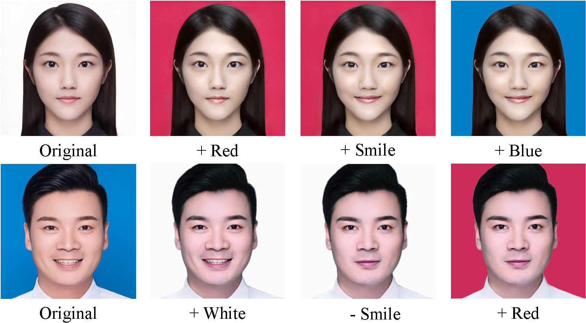

# CCFAM



**Minimising Distortion for GAN-based Facial Attribute Manipulation**

Mingyu Shao, Li Lu, Ye Ding, Qing Liao

## Release notes

This implementation provides:

* Instructions about portfolio portrait manipulation.

* Pretrained directions between different background colours.

## Requirements

High-end NVIDIA GPUs with at least 12 GB of memory.

Using the following commands to create and activate your Python environment:

```shell
conda create --name <env> --file requirements.txt
conda activate <env>
```

## Getting Started

Our proposed dataset can be found [here](https://drive.google.com/file/d/11E8lmtjWsUeeSqVBR-Lf_-Y0H5EieGSi/view?usp=share_link).

Using the following commands for image alignment:

```shell
python align_images.py /raw_images /aligned_images
```

Process the dataset and replace background (prepare the mask):

```shell
python trans_dataset_bg_process.py
python replace_bg.py
```

Get latent code:

```shell
python encode_images.py /aligned_images /generated_images /latent_representations
```

Get direction (rename the script):

```shell
python get_x2x_direction.py
```

Redirection:

```shell
python re_direction.py
```

## Acknowledgement

We borrow a lot from StyleGAN2 implementation:

```
https://github.com/NVlabs/stylegan2
```

## Citation
